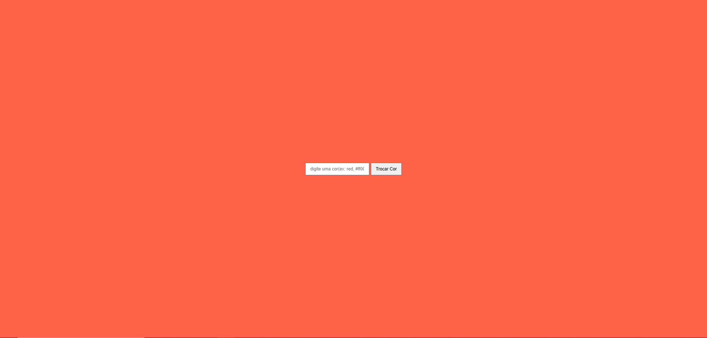

# Trocar cor do Site 

## Sobre
Site para trocar a cor da pagina utilizando o JS
O intuito deste projeto e colocar em pratica o conhecimento adquirido sobre linguaguem de marcaçao, HTML, CSS, Markdown e JS realizadas no curso tecnico de desenvolvimento de sistema do [SENAI Jandira](https://sp.senai.br/unidade/jandira/)
---
## Tecnologias utilizadas 
- HTML
- CSS
- Markdown
- Git
-JS

---
# Autor 
- [Bryan Martins]()
